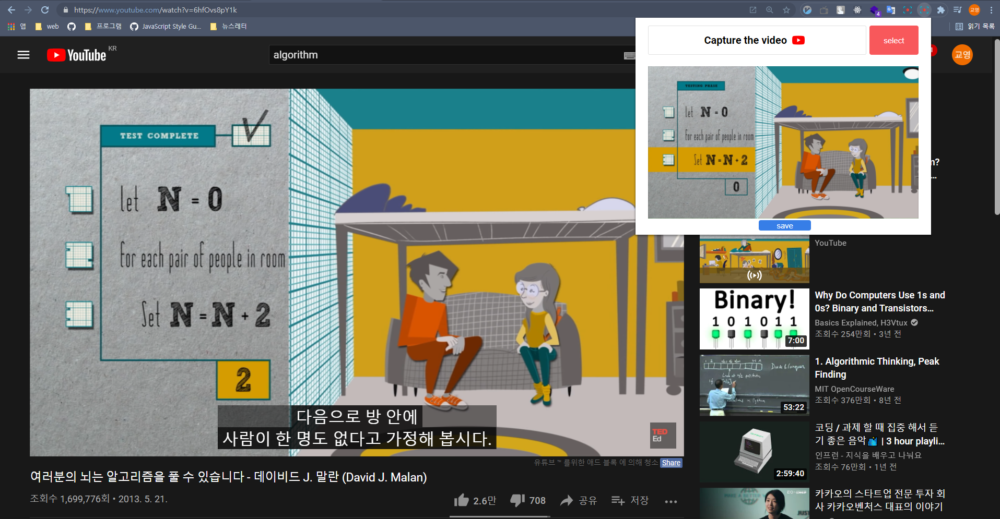

# Get a screenshot of any video with one click

**YouTube Screenshot** is a handy Chrome extension that allows you to easily capture high-quality screenshots from YouTube videos. 

With a single click, you can get the original width and height of the video capture, copy it to the clipboard, or save it as a PNG file.

Whether you need a screenshot for reference or sharing, YouTube Screenshot makes the process quick and hassle-free. Install the extension and start capturing YouTube screenshots today!

if you want to know how to work,
click [here](https://www.youtube.com/watch?v=Q8YnZipen_c)

[Download link](https://chrome.google.com/webstore/detail/youtube-capture/dhnikjofbddmfnkonpedeajjkhoecdfp?hl=ko)

